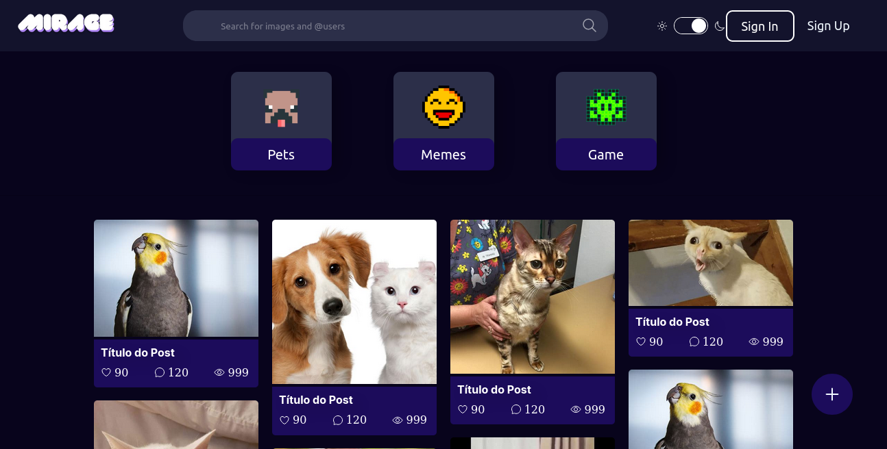
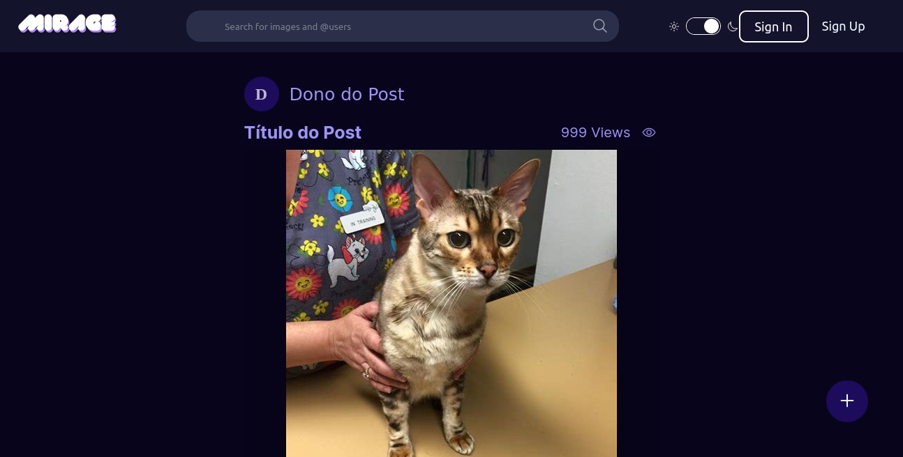
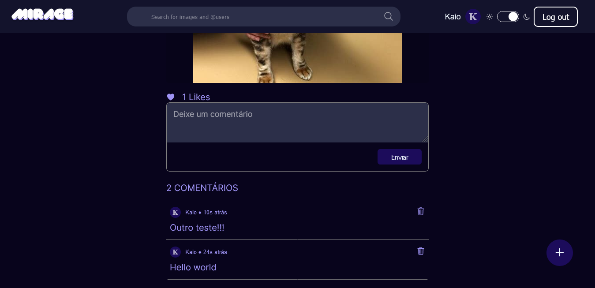
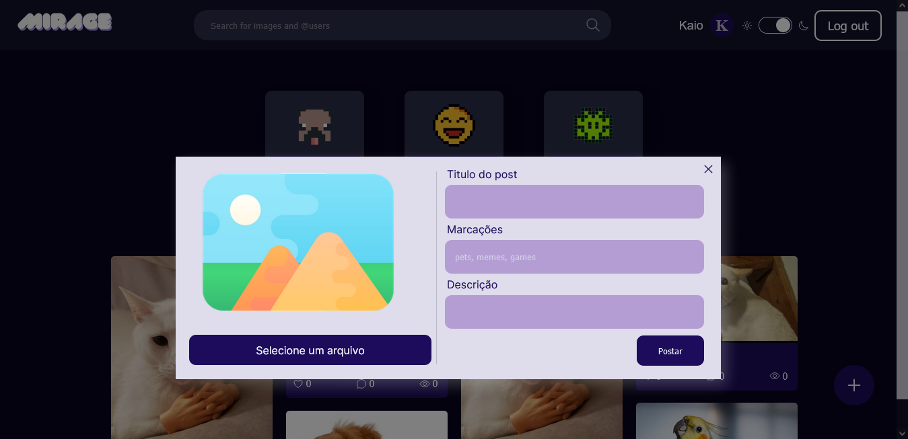
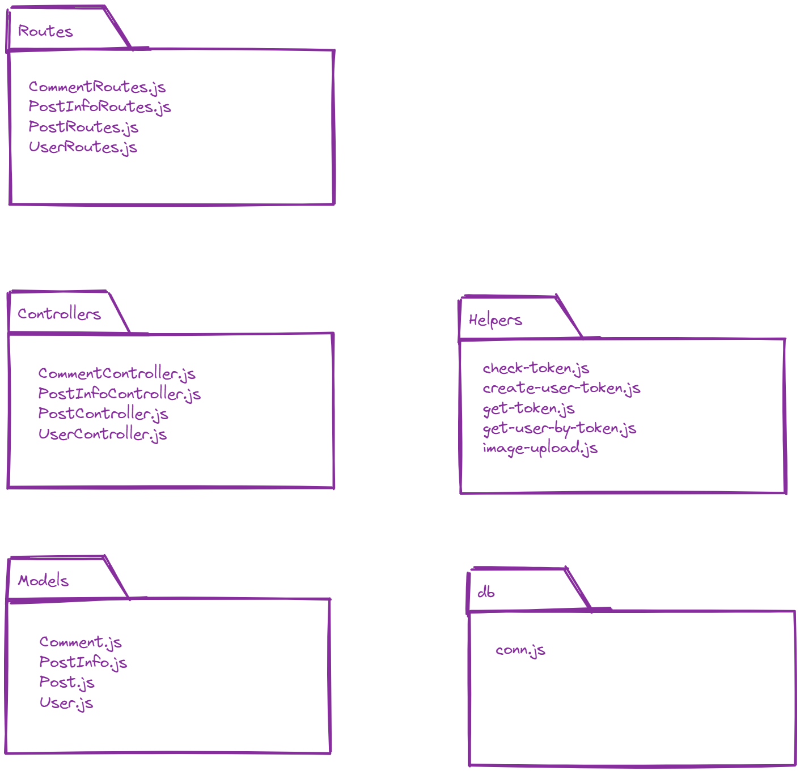
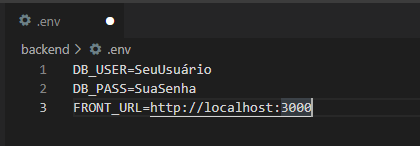
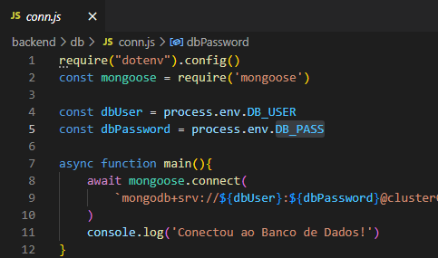
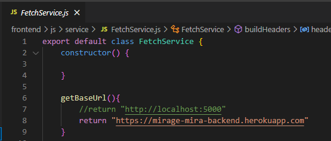

# MIRAGE

# Devs 💻

[Kaio Henrique](https://github.com/Kaioh95) e [Giovanna](https://github.com/giooogk)

## Descrição

O projeto Mirage é uma nova proposta de entretenimento para a comunidade virtual que gosta de compartilhar imagens, memes engraçados e jogos como os de game boy.

A Mirage é uma plataforma que permite a interação social por meio do compartilhamento de imagens ou por meio de rankings de jogos competitivos.

Nosso objetivo é oferecer aos usuários compartilhar imagens ao mesmo tempo em que seja possível adicionar tags às imagens compartilhadas, as tags associadas às publicações ajudam no filtro do conteúdo que o usuário deseja consumir e a plataforma faz uso dessas tags para sugerir as categorias mais consumidas(visualizadas) no momento. O usuário também terá a opção de ver imagens de outros usuários em uma única tela ou acessar o perfil de outros usuários.

Como os usuários podem interagir entre si? Apenas quando estiver logado, um usuário pode curtir e/ou comentar o que outros usuários compartilharam. Os usuários também podem competir entre si jogando os minigames e disputando para se manterem no top 10 do ranking. 

## Prototipagem

Antes de escrever qualquer código HTML + CSS, primeiramente foram criados protótipos no [figma](https://www.figma.com/file/cYbtBC2htZzBSrYDuY3hb2/Mirage), veja a seguir alguns prints das telas iniciais.

A primeira tela abaixo seria a tela inicial do site, onde há uma barra de pesquisa, área de login, um menu de categorias e área dos posts divididos em quatro colunas. Em seguida, temos a tela de post onde é possível curtir e comentar um post específico e por fim a tela de login.

## Implementação

Implementamos utilizando HTML e CSS, as cores foram trocadas para melhor visualização do site, e o resultado foi o seguinte.

Também adicionamos um switch para mudar para o tema escuro. Observe também na quarta imagem, o modal para preencher informações relativas ao post que o usuário pode criar e na terceira imagem temos um espaço de comentários onde é possível escrever ou excluir um comentário, além de ser possível deixar um “gostei” no post.

<p align="center">
   
</p>

<p align="center">
   
</p>

<p align="center">
   
</p>

<p align="center">
   
</p>

## Sistema
1. Backend

    O backend foi implementado em Node.js utilizando o Mongodb como banco de dados. Nosso servidor foi dividido da seguinte forma.

<p align="center">
   
</p>

   Para facilitar o desenvolvimento da aplicação foram utilizadas ferramentas para criação tokens de validação, upload de arquivos, encriptação de senhas. a seguir a lista de ferramentas utilizadas:

- [bcrypt](https://bcrypt.online/)
- [cookie-parser](https://www.npmjs.com/package/cookie-parser)
- [cors](https://www.npmjs.com/package/cors)
- [dotenv](https://www.dotenv.org/)
- [express](https://expressjs.com/)
- [jsonwebtoken](https://jwt.io/)
- [mongoose](https://mongoosejs.com/)
- [multer](https://openbase.com/js/multer)


2. Frontend
Já no frontend não foi utilizado nenhum framework, além de alguns CDNs para ícones ([IonIcons](https://ionic.io/)) e para fontes. Para fazer requisições à api do backend foi utilizado o [Fetch](https://javascript.info/fetch).

## Como Executar?
Caso deseje rodar a aplicação localmente, primeiramente é necessário definir um arquivo .env com as seguinte variáveis de ambiente na pasta backend/ utilizando usuário e senha definidos no Mongo Atlas.

<p align="center">
   
</p>

Agora você deve definir sua string de conexão ao banco de dados do Mongo Atlas no arquivo backend/db/[conn.js](backend/db/conn.js)

<p align="center">
   
</p>

e agora execute o seguinte comando
```bash
$ npm run dev
```

Caso a mensagem “Conectou ao Banco de Dados!” apareça no terminal, então o servidor backend está funcionando corretamente.

Agora, para executar o frontend é necessário alterar a string de url base da api no arquivo frontend/js/service/[FetchService.js](frontend/js/service/FetchService.js)


<p align="center">
   
</p>

Basta executar o frontend na porta 3000 para utilizar a aplicação, podendo rodar o seguinte comando:

```bash
$ python3 -m http.server 3000
```

Após estes passos é possível utilizar a aplicação em localhost:3000 .

## Links
- [Figma](https://www.figma.com/file/cYbtBC2htZzBSrYDuY3hb2/Mirage)
- [Link do repositório](https://github.com/Kaioh95/mirage)
- [APP](https://mirage-mira.herokuapp.com)
- [README](https://kaioh95.github.io/mirage/)
